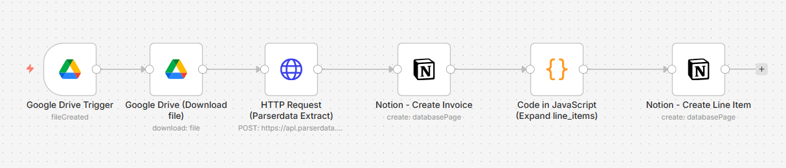

# Parserdata → Google Drive → Notion

This n8n workflow watches a Google Drive folder for newly added invoices (PDF/image), sends the file to the Parserdata Extract API, then writes:

- One row into Invoices DB (Notion)

- Multiple rows into Line Items DB (Notion), linked back to the invoice via a relation

---

## What it extracts

Invoice-level fields

- `invoice_number`

- `invoice_date (YYYY-MM-DD)`

- `supplier_name`

- `total_amount`

Line items (table rows)

- `sku`

- `description`

- `quantity`

- `unit_price`

- `net_amount`

---

## Workflow overview

**Google Drive Trigger** (folder watch)

**Google Drive**: Download file

**HTTP Request**: Parserdata Extract (multipart upload)

**Notion**: Create Invoice

**Code**: Expand line_items (one n8n item per line)

**Notion**: Create Line Item (linked to invoice)

---

## Requirements

- n8n (cloud or self-hosted)

- Google account with access to the Drive folder

- Notion workspace

- Parserdata API key

---

## Files

`notion_workflow.json` — the n8n workflow you can import

`README.md` — this guide

## 1) Notion setup (2 databases + relation)

You need two Notion databases.

### A) Invoices DB (Database #1)

Create a Notion database with these columns:

- Name (Title) — Notion default title property

- Supplier (Text / rich_text)

- Invoice Date (Date)

- Total Amount (Number)

- Drive File ID (Text / rich_text)

- Line Items → Relation (Relation to Line Items DB)

The workflow uses these exact property names. Keep spelling identical.

### B) Line Items DB (Database #2)

Create a second Notion database with these columns:

- Name (Title) — Notion default title property

- SKU (Text / rich_text)

- Description (Text / rich_text)

- Quantity (Number)

- Unit Price (Number)

- Net Amount (Number)

- Invoice (backlink) (Relation to Invoices DB)

### Create the relation correctly

In Notion:

- In Invoices DB, add a property Line Items → Relation → select Line Items DB

- Notion will auto-create the backlink in Line Items DB (rename it to Invoice (backlink))

That backlink is what the workflow writes to.

## 2) Create Notion credentials in n8n

### Step A — Create a Notion Integration (API token)

Open: `https://www.notion.so/profile/integrations`

Click **Create a new integration**

Name: **n8n Parserdata**

Copy the Internal Integration Token (looks like ntn_...)

### Step B — Share BOTH databases with the integration

Open **Access** and add:

- Invoices DB

- Line Items DB

If you skip this, n8n will fail with "database not found".

### Step C — Add Notion credential in n8n

In n8n:

**Credentials → New**

Select **Notion API**

Paste the token into Access Token

Save

## 3) Get Notion Database IDs

You will need:

`YOUR_NOTION_INVOICES_DB_ID`

`YOUR_NOTION_LINE_ITEMS_DB_ID`

Example:
305937f2-ce97-80c7-a932-c7c2258bff8a

## 4) Create Google Drive credentials in n8n

In n8n:

**Credentials → New**

Search: **Google Drive OAuth2 API**

Follow the OAuth connection flow (Sign in to Google and allow access)

Save

## 5) Create Parserdata credentials in n8n

This workflow uses HTTP Header Auth.

In n8n:

**Credentials → New**

Search: **HTTP Header Auth**

Set:

- Name: Parserdata API

- Header Name: Authorization

-Header Value: Bearer pd_live_YOUR_API_KEY

Save

Then select this credential inside node:

`HTTP Request (Parserdata Extract) → Authentication → httpHeaderAuth`

## 6) Import the workflow into n8n

In n8n:

- Click Workflows
- Click Import from File (or paste JSON)
- Paste the workflow JSON
- Save

## 7) Configure the workflow placeholders

Edit these values:

#### A) Google Drive Trigger

`folderToWatch` → set to your Drive folder ID

You can copy folder ID from Drive URL (the part after /folders/)

#### B) Notion nodes

Notion - Create Invoice

- databaseId → `YOUR_NOTION_INVOICES_DB_ID`

Notion - Create Line Item

- databaseId → `YOUR_NOTION_LINE_ITEMS_DB_ID`

#### C) Credentials selection

After import, open each node and select credentials:

Google Drive Trigger + Download node → Google Drive OAuth credential

Notion nodes → Notion API credential

Parserdata HTTP node → HTTP Header Auth credential

## 8) Run a test

Upload an invoice file into the watched Google Drive folder

Watch execution:

- One page should appear in Invoices DB

- Multiple pages should appear in Line Items DB

Invoice row should show linked items in Line Items → Relation

---

## Troubleshooting

### "Notion database is empty / fields are null"

- Ensure you mapped properties in the Notion node

- Ensure property names match exactly:

  - `Supplier`

  - `Invoice Date`

  - `Total Amount`

  - `Drive File ID`

### "Line Items relation is empty"

- Ensure Line Items DB has Invoice (backlink) relation property

- Ensure Notion - Create Line Item maps:

  - Invoice (backlink)|relation → `={{ $json.invoicePageId }}`

---

## Support

If you need help with setup, customization, or production integration:

- Open a GitHub issue in this repository
- Contact the Parserdata team at `support@parserdata.com`
- Request integration guidance for custom workflows (ERP, accounting systems, BI tools, etc.)

We're happy to assist with:

- n8n deployment and configuration
- Advanced Notion database design
- Google Drive / document automation setup
- Custom extraction schemas
- API-based integrations

For enterprise use cases or tailored automation pipelines, please reach out directly.

---

## License

MIT
